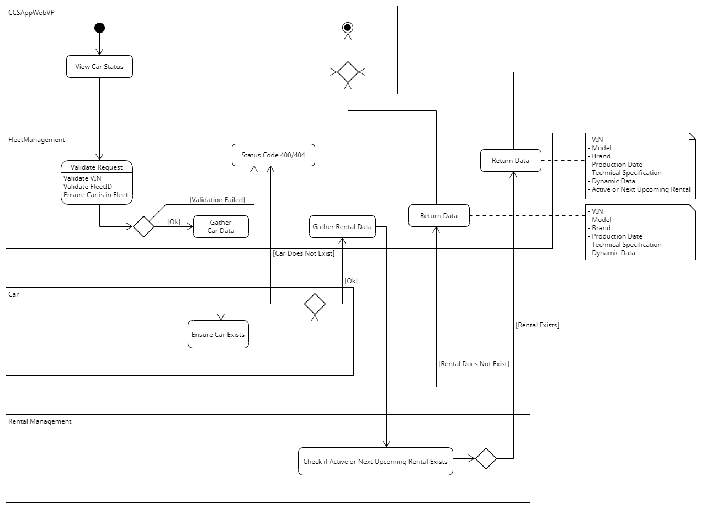

# Task Processes

## Management of the Fleet

### Add Car to Fleet (see [Use Case "Add Car to Fleet"](https://github.com/ccsapp/docs/blob/main/pages/use_case_add_car_to_fleet.md))

### Remove Car from Fleet (see [Use Case "Remove Car from Fleet"](https://github.com/ccsapp/docs/blob/main/pages/use_case_remove_car_from_fleet.md))

### View Car Status (see [Use Case "View Car Status"](https://github.com/ccsapp/docs/blob/main/pages/use_case_view_car_status.md))

### View Fleet Overview (see [Use Case "View Fleet Overview"](https://github.com/ccsapp/docs/blob/main/pages/use_case_view_fleet_overview.md))

